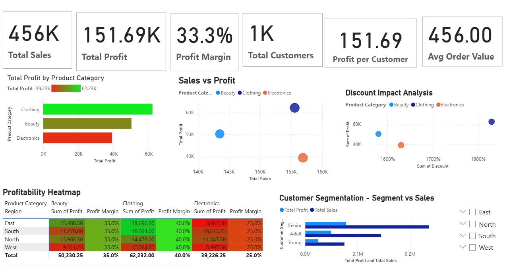

# Retail Sales Intelligence Dashboard (Power BI)

## Overview

This project presents a comprehensive analysis of retail transaction data to evaluate sales performance, profitability, and customer behavior. The dashboard enables data-driven decision-making through interactive visualizations and key performance indicators.

---

##  Business Objective

Retail businesses often lack visibility into:

* Profitability across product categories
* Impact of discounts on revenue and margins
* Customer purchasing patterns

This project aims to bridge that gap by transforming raw transaction data into actionable insights.

---

##  Methodology

### 🔹 Data Preparation

* Cleaned and structured raw dataset
* Handled missing values and standardized formats

### 🔹 Feature Engineering

Since the original dataset lacked key business metrics, additional fields were created:

* **Profit** → Derived using assumed margin logic
* **Discount** → Introduced to analyze pricing impact
* **Customer Segment** → Classified based on age groups (Young, Adult, Senior)
* **Region** → Added to simulate geographic analysis

### 🔹 Data Modeling

* Built relationships within Power BI
* Created calculated measures using DAX

### 🔹 Visualization Design

Developed an interactive dashboard including:

* KPI cards for quick insights
* Category-wise profit analysis
* Sales vs Profit comparison
* Discount impact analysis
* Customer segmentation visuals
* Regional performance heatmap

---

##  Key Metrics

* **Total Sales:** 456K
* **Total Profit:** 151.69K
* **Profit Margin:** 33.3%
* **Total Customers:** 1K
* **Average Order Value:** 456

---

##  Key Insights

* Clothing category contributes the highest overall profit
* Electronics category shows lower margins due to higher discount impact
* Senior customers generate the highest revenue contribution
* Profitability varies significantly across regions
* Discounts do not consistently improve profit, indicating inefficient pricing strategies

---

##  Business Recommendations

* Optimize discount strategies to protect profit margins
* Focus on high-performing product categories
* Target high-value customer segments for marketing campaigns
* Improve pricing models for low-margin categories

---

##  Technical Highlights

* Power BI Dashboard Development
* DAX Measures & Calculated Columns
* Data Cleaning & Transformation
* Feature Engineering for missing business metrics
* Interactive Data Visualization

---

##  Dashboard Preview

---

## 🚀 Outcome

This project demonstrates the ability to transform raw data into meaningful business insights, enabling better strategic decisions in retail operations.

---

⭐ If you found this project useful, consider giving it a star!
